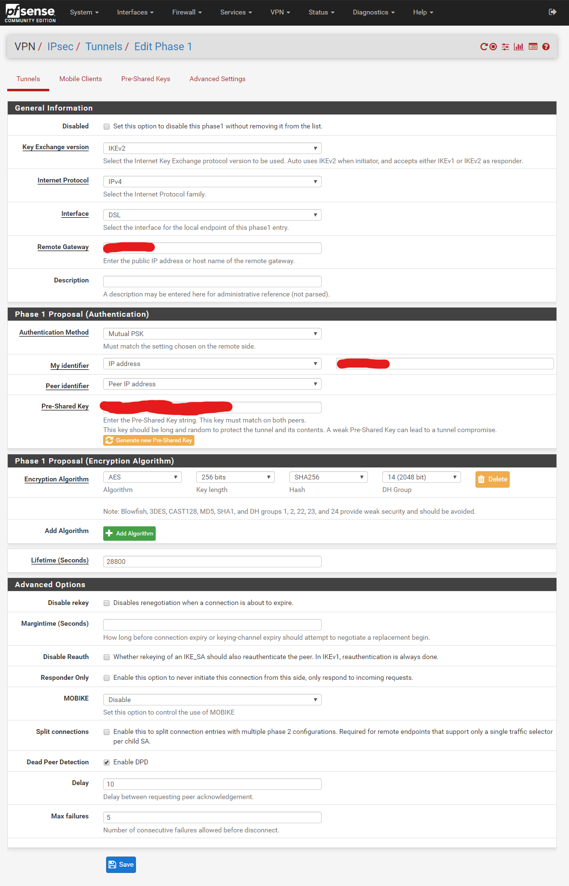
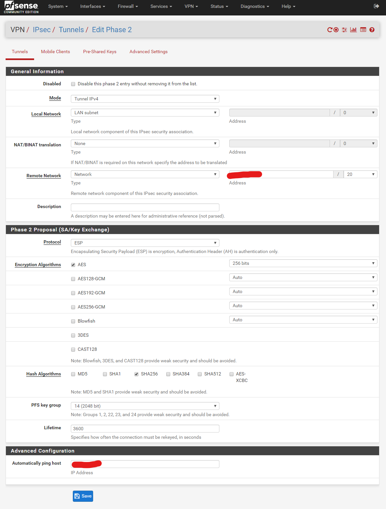
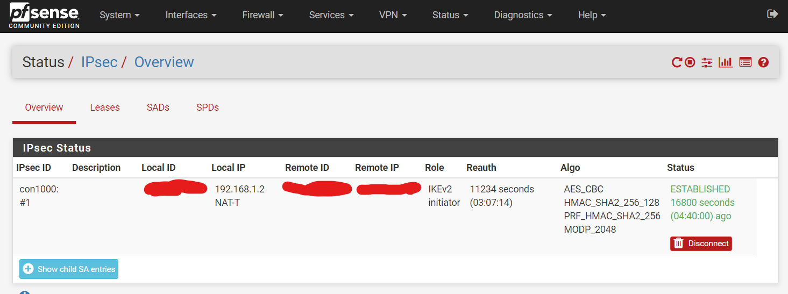

# IPsec Tunnel between Google Cloud Platform and pfSense

Bash script to connect your pfSense firewall at home or at work to the Google Cloud Platform (GCP) via IPsec VPN.
Works even with a non-static IP address (dynamic IPv4) at home.
Tested with pfSense 2.4.4-RELEASE-p3.

## Requirements

Bash shell and:

* SSH client: `ssh`
* [curl](https://curl.haxx.se/): `curl`
* [Google Cloud SDK](https://cloud.google.com/sdk/docs/quickstarts): `gcloud`
    * Initialize your Google SDK CLI as described in [Google Help](https://cloud.google.com/sdk/docs/initializing).

**Enable SSH** access on your **pfSense firewall** as described in [Netgate Docs](https://docs.netgate.com/pfsense/en/latest/usermanager/granting-users-access-to-ssh.html).

## Usage

```
Usage: gcp-vpn.sh OPTION:
    OPTION is one of the following:
        ip       Show my external IPv4 address
        list     List VPN tunnels and routes in GCP project
        create   Create VPN tunnel and route in GCP project
        delete   Delete route and VPN tunnel in GCP project
        pfsense  Update my identifier (myid_data) to current IPv4 and apply
        refresh  1. Delete route and VPN tunnel in GCP project
                 2. Create new VPN tunnel and route in GCP project
                 3. Update my identifier (myid_data) in pfSense
                 4. Apply new IPsec VPN
        help     Displays help (this message)
```

## Installation

```
# Download gcp-vpn.sh
curl -f https://raw.githubusercontent.com/Cyclenerd/google-cloud-gcp-pfsense/master/gcp-vpn.sh -o gcp-vpn.sh
```

## Configuration

The entire configuration is stored in the `config` file.
Some configuration values can not be entered yet.
You will get them later when you read this documentation.

```
# Creat config file
curl -f https://raw.githubusercontent.com/Cyclenerd/google-cloud-gcp-pfsense/master/config-default -o config
# Edit config
vi config
```

## My Network

To make the setup easier to understand, I will briefly explain my network setup. Maybe yours is similar.

```
        +-------------+
        | LAN Network |
        +------+------+
               |
     +---------+----------+
     | LAN (192.168.10.1) |
     |                    |
     |      pfSense       |
     |                    |
     | DSL (192.168.1.2)  |
     +---------+----------+
               |
 +-------------+--------------+
 | DSL Modem with Router      |
 | (192.168.1.1)              |
 | Internet with dynamic IPv4 |
 +-------------+--------------+
               |
          +----+-----+
          | Internet |
          +----------+
```

## Setup

### External IPv4 Address

First, you have to find out your current external IPv4 address. Execute the following command:

```
bash gcp-vpn.sh ip
```

### Cloud VPN Gateway

Next, you need to set up a VPN gateway on the Google Cloud Platform side.
If you have already set up a VPN gateway, you can continue with the next step.

In the console go to "Hybrid Connectivity" -> "VPN" -> "Cloud VPN Gateways" and click on "Create VPN gateway".
It is important that you then select "Classic VPN".

The wizard also wants to create a tunnel.
The tunnel will be created automatically later with the script `gcp-vpn.sh`.
Click on the trashcan to not create the tunnel.

Write down the external IPv4 address of the VPN gateway at Google.
You'll need the IP later when you set up the tunnel in your pfSense firewall.

### IPSec Tunnel in PfSense

Now let’s create the settings on the PfSense machine.

#### Phase 1

From the pfSense admin console go to "VPN" -> "IPsec" -> "Tunnels" and click on "Add P1" (Phase 1) and fill out all the settings:

* **Remote Gateway:** The external IPv4 address of the VPN gateway at Google
* **My identifier:** IP adress and your current external IPv4 address
* **Pre-Shared Key:** Generate new key and save it in the `config` file.
* The other settings can be taken as shown in the screenshot



#### Phase 2

After the Phase 1 configurations are added, add a Phase 2 configuration and set your settings depending on your setup:

* **Remote Network:** Your GCP VPC network subnet
* **Automatically ping host:** Host in your VPC network (OPTIONAL)
* The other settings can be taken as shown in the screenshot



### Cloud VPN Tunnel

Now the VPN tunnel and route can be created in the Google Cloud with the script `gcp-vpn.sh`.
Check the `config` file. All variables should now have the correct value.

Execute the command:

```
bash gcp-vpn.sh create
```

If no error message appears, the tunnel and route has been successfully created.

From the pfSense admin console go to "Status" -> "IPsec". Your tunnel should have status "ESTABLISHED":



## Refresh

If your external IP address has changed, the tunnel will no longer work.
You will have to rebuild the VPN at Google and update your identifier in pfSense.

To do this you simply execute the command:

```
bash gcp-von.sh refresh
```

The following steps are performed:

1. Delete route and VPN tunnel in GCP project
2. Create new VPN tunnel and route in GCP project
3. Update my identifier (`myid_data`) to current externel IPv4 adress in pfSense
4. Apply new IPsec VPN

### Note

Currently, the refresh function only works for the first ( `[0]` ) VPN in pfSense. If you have more than one, you have to change it manually in the source code: 

```bash
echo "\$config['ipsec']['phase1'][0]['myid_data'] = '$MY_EXTERNAL_IP';"
```

## License

GNU Public License version 3. Please feel free to fork and modify this on GitHub (https://github.com/Cyclenerd/google-cloud-gcp-pfsense).